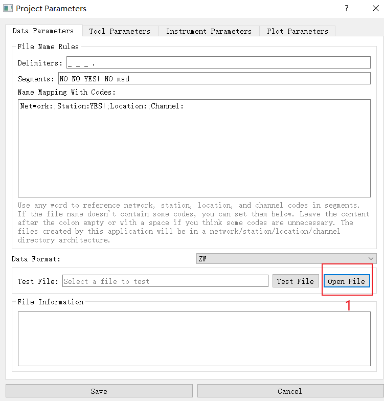
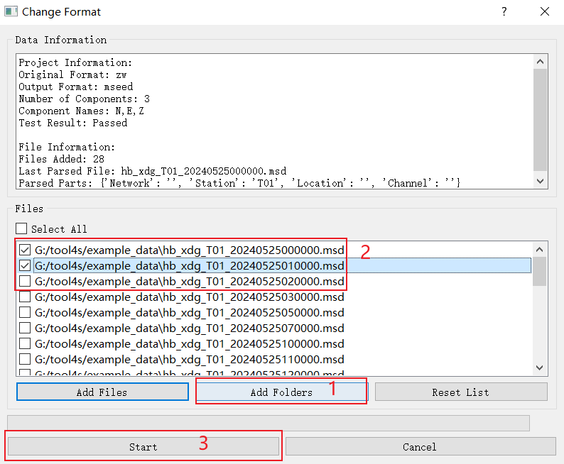
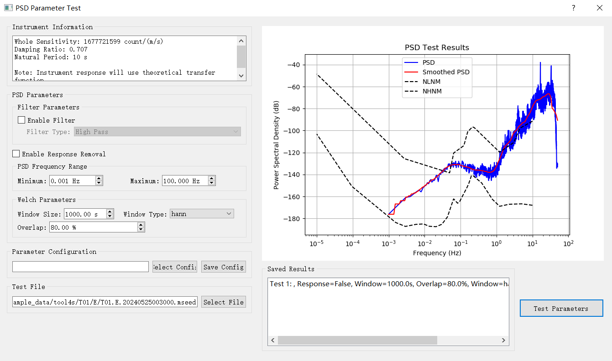
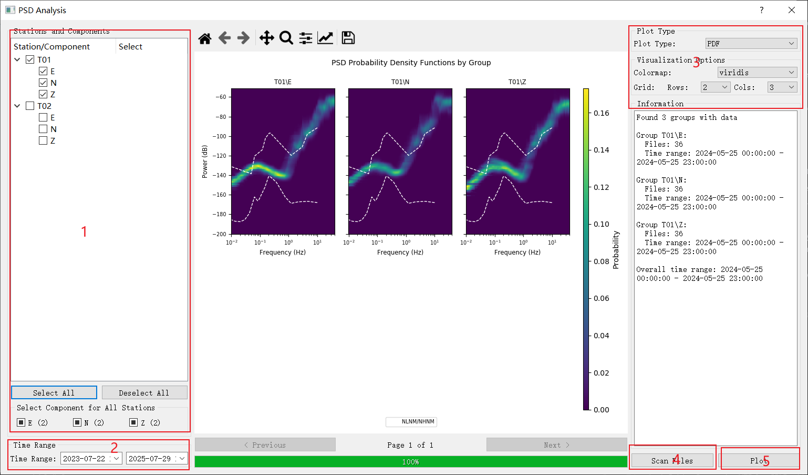

# Tool4S

[](https://github.com/dingbule/tool4s)
[](https://www.python.org/)
[](LICENSE)

A GUI-based software for seismic site station selection data processing and analyzing based on Python.

## Features

- **Multi-format Data Support**: Plugin architecture for various seismic formats (MSEED, SAC, SEGY, ZW, and proprietary formats)
- **Data Processing Tools**: File cutting, merging, and format conversion
- **Parameter Testing**: Real-time Power Spectral Density parameter test
- **PSD calculation & Analysis**: PSD calculation and analysis using various methods.
- **Visualization**: File plotting and interactive visualization using Matplotlib

## Examples & Screenshots

Here are some examples showing how to use Tool4S for seismic data analysis, a step-by-step instruction is provided in `example_data`:

### 1. Setting Up a Project



Start by creating a new project and selecting your working directory:
- Launch Tool4S
- Go to File > Project Parameters
- Set your project parameters

### 2. Data Processing



Process your raw seismic data files:
- Select the file in the project browser
- Use the Tools menu to access processing options
- Cut, merge or convert files as needed

### 3. PSD Calculation



Calculate Power Spectral Density:
- Select processed files
- Open the PSD Calculation dialog
- Configure parameters (window size, overlap, etc.)
- Run the calculation

### 4. Analysis and Visualization



Analyze your results:
- View PSD plots with noise model comparisons
- Generate PDF reports
- Export results for further analysis

## Installation

We have tested the installation on Windows 10 and Ubuntu 18.04.

### Using Conda (Recommended)

```bash
# Clone repository
git clone https://github.com/dingbule/tool4s.git
cd tool4s

# Create and activate conda environment with Python 3.8
conda create -n tool4s python=3.8
conda activate tool4s

# Install dependencies
pip install -r requirements.txt

# Run application
python __main__.py
```

### Using Pip

```bash
# Clone repository
git clone https://github.com/dingbule/tool4s.git
cd tool4s

# Install dependencies
pip install -r requirements.txt

# Run application
python __main__.py
```

## Executable Application  (Windows)

We provide a pre-built executable for Windows 10 in the `Application` folder. You can download it to use Tool4S directly.

### Building Your Own Executable

```bash
# Build executable (Windows)
pyinstaller main.spec
```

The executable will be created in the `dist` folder. If you build your own executable, you should put it in the `Application` folder where several necessary DLL files are alreadly located.

> **Note**: The executable build has only been tested on Windows 10. The `hooks` and `rthooks` folders are required for the PyInstaller build process.

## Project Structure

```
tool4s/
├── core/           # Core processing modules
│   ├── psd.py      # Power Spectral Density calculator
│   └── data/       # Reference data including noise models
├── gui/            # User interface components
│   ├── dialogs/    # Application dialog windows
│   └── plot_widget.py # Visualization components
├── plugins/        # Data format readers
│   ├── mseed_reader.py
│   ├── sac_reader.py
│   └── ...
├── utils/          # Utility functions and helpers
├── __main__.py     # Application entry point
├── requirements.txt # Dependencies

*Used to built your own executables
├── Application/    # Pre-built executables
├── rthooks         # Used by pyinstaller
├── hooks           # Used by pyinstaller
├── main.spec       # Used by pyinstaller
├── build           # Created by pyinstaller
└── dist            # Created by pyinstaller

*Folder and file created while Tool4S starts up once
├── logs            # logs 
└── config.ini      # config for Tool4S


```

## Usage Guide

1. **Launch the application** and set your project directory
2. **Configure parameters** in the settings dialog
   - Set output folder location
   - Configure project-specific parameters
3. **Process raw data files** using the Tools menu
   - Cut, merge, or convert seismic data files
   - Prepare data for PSD calculation
4. **Perform PSD analysis**
   - Test different PSD parameters to optimize results
   - Run batch PSD calculations on multiple files
5. **Analyze results**
   - Compare with standard noise models (NHNM/NLNM)
   - Generate PDF reports and visualizations

## Key Features Explained

### Power Spectral Density (PSD) Analysis

Tool4S implements advanced PSD calculation for seismic data:

- Detrending and sensitivity correction
- Optional high-pass and band-pass filtering
- Welch's method with configurable window parameters
- Instrument response removal
- Octave-based smoothing for noise analysis
- Comparison with New High/Low Noise Models

### Plugin System

The application uses a plugin architecture for reading different seismic data formats:

- Base reader interface with standardized methods
- Support for common formats (MSEED, SAC, SEGY, etc)
- Easy extension for custom or proprietary formats

## Dependencies

- **Python**: 3.8
- **Scientific**: numpy, scipy, matplotlib, obspy
- **GUI**: PyQt5
- **Build(optional)**: pyinstaller

## Contributing

Contributions are welcome! Please feel free to submit a Pull Request.

## License

This project is licensed under the MIT License - see the [LICENSE](LICENSE) file for details.

---

**Tool4S** - Making seismic analysis accessible and efficient. 