# Example Data for Tool4S

This directory contains sample seismic data files for demonstrating Tool4S functionality. The examples show how to process seismic data and perform PSD (Power Spectral Density) analysis.

## Data Files

The example data includes files in the following format:
- `hb_xdg_T01_YYYYMMDDHHMMSS.msd` - ZW format , a proprietary format created by ZhiWei company.
- Each file contains three components (E, N, Z) with one-hour length.

## Step-by-Step Tutorial

### 1. Setting Up a Project

1. Launch Tool4S
2. Go to **Project > Open Project Directory** 

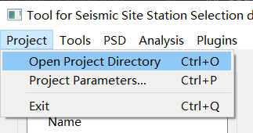

Select the **example_data** folder

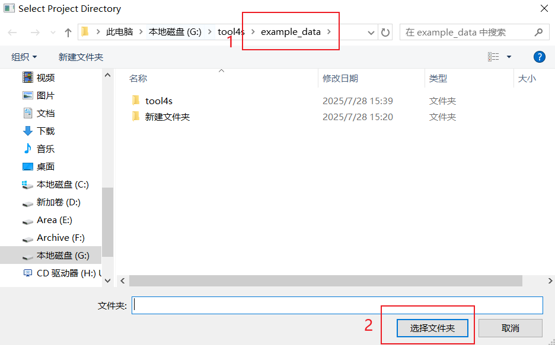

3. Go to **Project > Project Parameters**

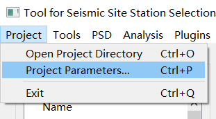

We have provided an example **data.json** file which is a configuration file for Tool4S, you should set and save your own **data.json** for your own project.

4. Set up parameters and test a raw data file

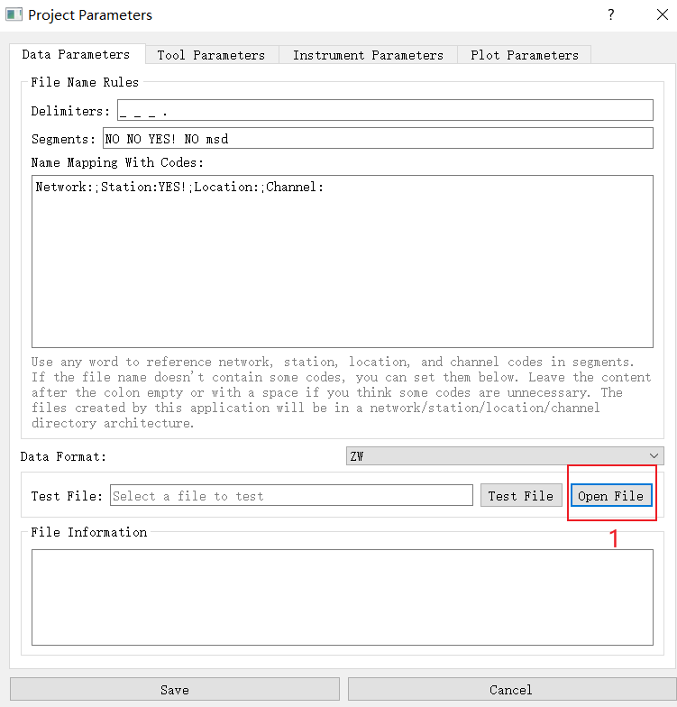
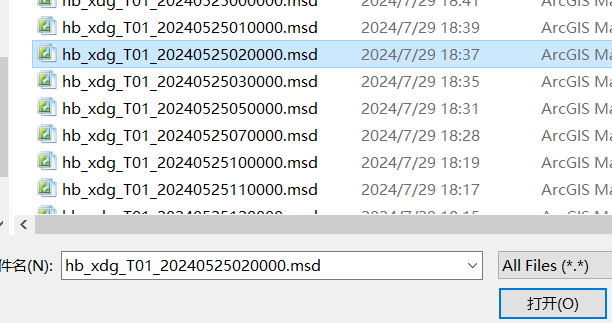

5. Check the test result and **save** the result.

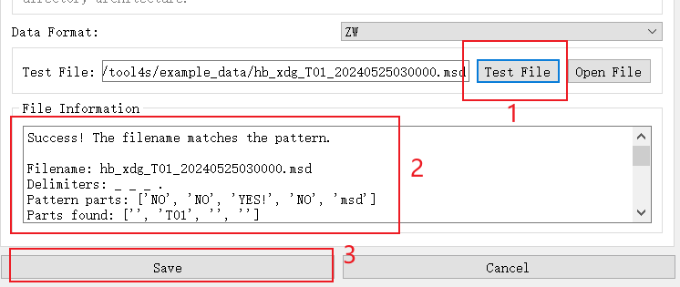

In the Project Parameters dialog:
   - Configure file name rules with appropriate delimiters (`_`, `.`)
   - Set the data format (ZW, MSEED, etc.)
   - Test a file to verify the pattern matching works
   - Click **Save** when finished

You can double-click a raw data file in the left project panel to view the data plotting.

### 2. Processing Data Files

Since the example data files have exactly one-hour length with 3 components, we only need to split them into 3 individual files using change format tool.

Note:*In fact, other tools have the default splitting and changing format function.*

#### Format Conversion

1. Go to **Tools > Change Format...**

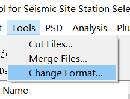

2. Select the files you want to convert
3. Add more files or folders if needed
4. Click **Start** to convert the files
5. The converted files will be saved in the project directory structure

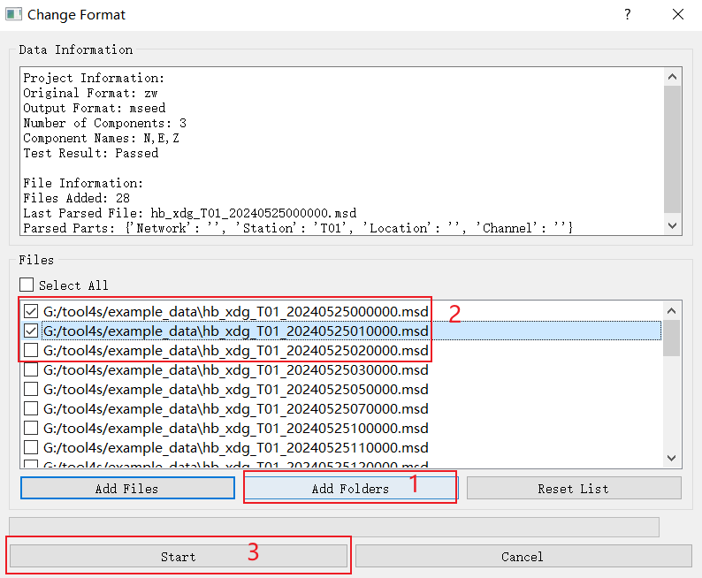 


### 3. PSD Parameter Testing

We provide a default PSD configuration file named psd.json, you can set up your own PSD parameters and save them.

1. Go to **PSD > PSD Parameter Test**

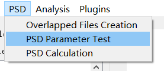 

2. Configure instrument information:
   - Whole Sensitivity (e.g., 1677721599 count/(m/s))
   - Damping Ratio (e.g., 0.707)
   - Natural Period (e.g., 10 s)
3. Set PSD parameters:
   - Filter settings (High Pass/Band Pass)
   - PSD frequency range (e.g., 0.001 Hz to 100 Hz)
   - Welch parameters (Window size, overlap, window type)
4. Select a test file and click **Test Parameters**

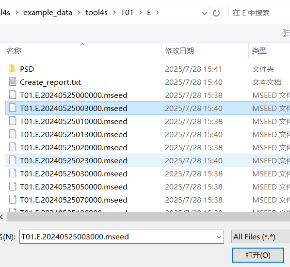 

5. View the results showing PSD, Smoothed PSD, and noise models (NLNM/NHNM)

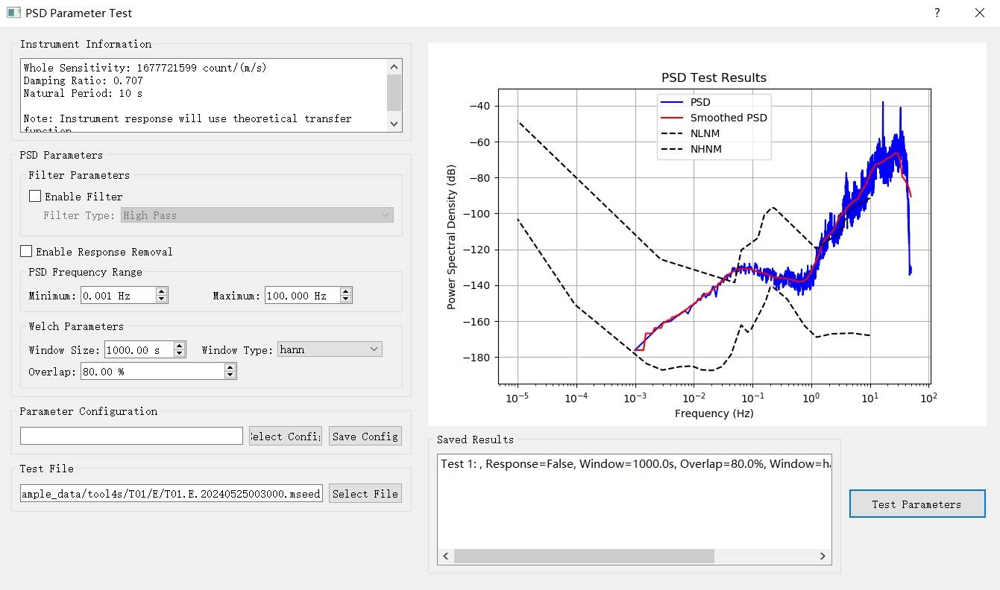 

### 4. PSD Calculation

1. Go to **PSD > PSD Calculation**

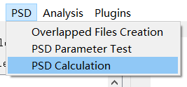 

2. In the Calculate PSD dialog:
   - Select stations and components (E, N, Z)
   - Set the time range for analysis
   - Click **Scan Files** to find matching files
   - Select or create a configuration file
   - Click **Start Processing** to calculate PSDs
  
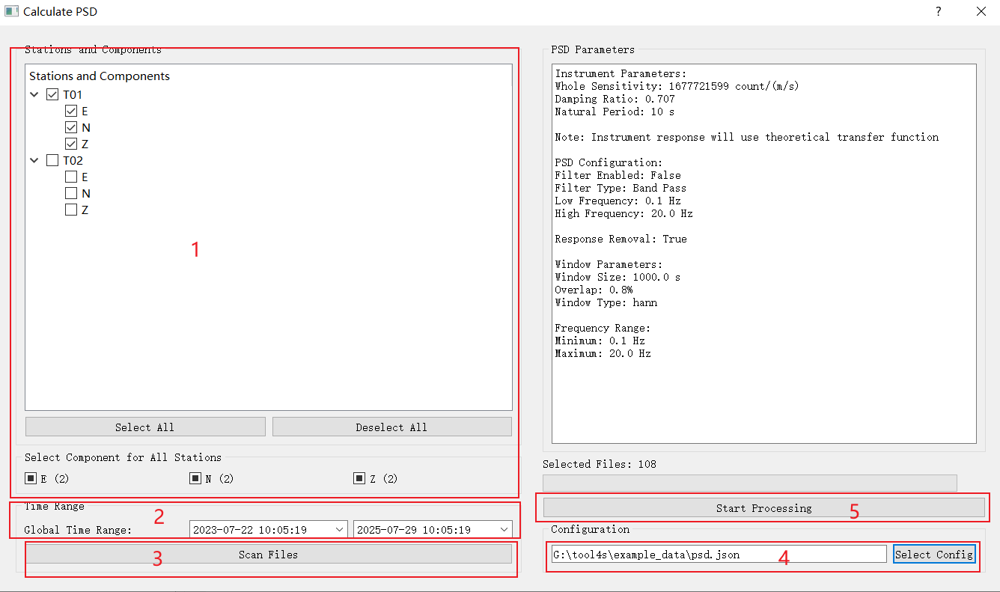 

### 5. PSD Analysis

1. Go to **Analysis > PSD Analysis**

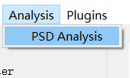 

2. In the PSD Analysis dialog:
   - Select stations and components to analyze
   - Set the time range for analysis
   - Click **Scan Files** to find matching PSD files
   - Configure plot options (PDF, colormap, grid layout)
   - Click **Plot** to generate visualizations
3. View the PSD probability density functions by component
4. Compare results against standard noise models

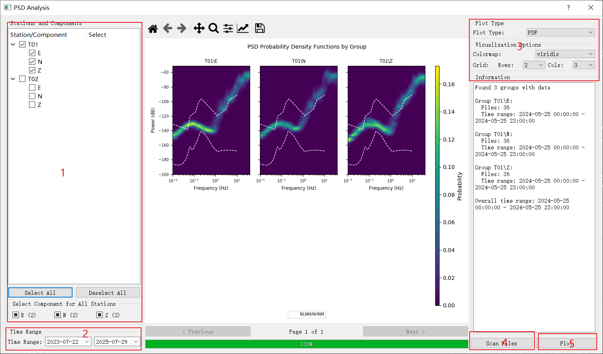 

## Output Directory Structure

After processing, files are organized in a directory structure:
```
tool4s/
└── T01/
    ├── E/
    │   ├── PSD/
    │   └── T01.E.YYYYMMDDHHMMSS.mseed
    ├── N/
    │   ├── PSD/
    │   └── T01.N.YYYYMMDDHHMMSS.mseed
    └── Z/
        ├── PSD/
        └── T01.Z.YYYYMMDDHHMMSS.mseed
```

## Notes on PSD Analysis


---

For questions about using these example files, please refer to the main Tool4S documentation or contact the development team. 
