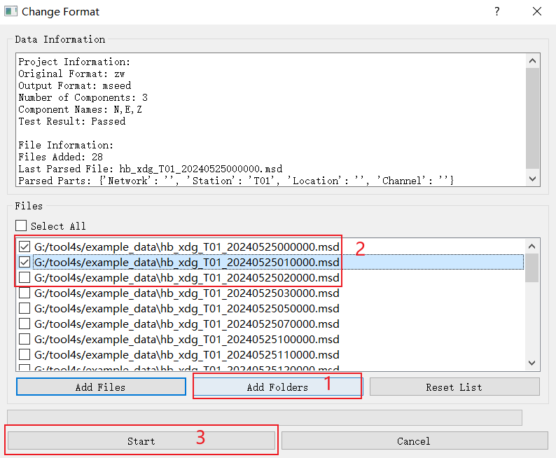
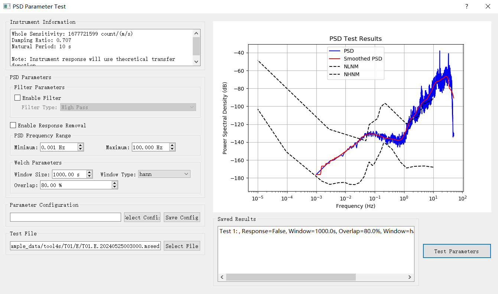

# Example Data for Tool4S

This directory contains sample seismic data files for demonstrating Tool4S functionality. The examples show how to process seismic data and perform PSD (Power Spectral Density) analysis.

## Data Files

The files are from short-period seismometers in ZW format, a proprietary format of Chengdu ZhiWei Company. Each file contains three components (E, N, Z) and has a duration of one hour.

The example data includes files in the following name format: `hb_xdg_T01_YYYYMMDDHHMMSS.msd` 

## Configuration Files

`data.json`: This file contains the configuration for Tool4S, including the project path, data format, and processing parameters. Several parameters have been preset, and it is recommended not to modify them. The file name is fixed as data.json and should be placed in the same directory as the data files.

`psd.json`: This file is the configuration file for PSD parameters and is used to configure the parameters for PSD analysis. You can modify and save the parameters in the PSD test dialog.

## Step-by-Step Tutorial

### 1. Setting Up a Project

1. Launch Tool4S
2. Open the project by clicking "Open Project" and select the project directory


3. Go to **Project > Project Parameters** (or press Ctrl+P)


4. In the Project Parameters dialog:
This example project is already set up with the correct parameters. You can modify them if needed. But a test is still needed. 
   - Click open file 

   

   - Select the data file like: `hb_xdg_T01_20220101000000.msd

   

   - Test a file to verify the pattern matching works
   - Click **Save** when finished

   

### 2. Processing Data Files

Tool4s will process the raw data files into separated single-component files with a specific length (usually 1 hour), which can be used for further PSD calculation.

#### Format Conversion

The example files are already 1 hour long, so we only need to convert them into separated component files. The other two tools have the same splitting and converting functions as the format conversion tool. They are used to convert files with unexpected lengths (we usually expect 1 hour for PSD calculation).

1. Go to **Tools > Change Format...**


2. Select the files you want to convert
3. Add more files or folders if needed
4. Click **Start** to convert the files



### 3. PSD Parameter Testing

1. Go to **PSD > PSD Parameter Test**


2. Select a file produced by Tool4S( in the output folder)


3. Set PSD parameters or load a PSD configuration file (psd.json)
4. Select a test file and click **Test Parameters**
5. View the results showing PSD, Smoothed PSD, and noise models (NLNM/NHNM)



### 4. PSD Calculation

1. Go to **PSD > PSD Calculation**


2. In the Calculate PSD dialog:
   - Select stations and components (E, N, Z)
   - Set the time range for analysis
   - Click **Scan Files** to find matching files
   - Select a configuration file
   - Click **Start Processing** to calculate PSDs


### 5. PSD Analysis

1. Go to **Analysis > PSD Analysis**


2. In the PSD Analysis dialog:
   - Select stations and components to analyze
   - Set the time range for analysis
   - Click **Scan Files** to find matching PSD files
   - Configure plot options (PDF, colormap, grid layout)
   - Click **Plot** to generate visualizations
3. View the PSD probability density functions by component


## File Naming Convention

The example files follow this naming convention:
`hb_xdg_T01_YYYYMMDDHHMMSS.msd`

Where:
- `hb_xdg` - Network or location identifier
- `T01` - Station name
- `YYYYMMDDHHMMSS` - Timestamp (year, month, day, hour, minute, second)
- `.msd` - File extension( actually a ZW format)

## Output Directory Structure

After processing, files are organized in a directory structure:
```
tool4s/
└── T01/
    ├── E/
    │   ├── PSD/
    │   └── T01.E.YYYYMMDDHHMMSS.mseed
    ├── N/
    │   ├── PSD/
    │   └── T01.N.YYYYMMDDHHMMSS.mseed
    └── Z/
        ├── PSD/
        └── T01.Z.YYYYMMDDHHMMSS.mseed
```

## Notes on PSD Analysis

- The PSD calculation compares results against New High/Low Noise Models (NHNM/NLNM)
- Default window size is 1000 seconds with 80% overlap
- The PSD probability density function plots show the statistical distribution of power levels across frequencies

---

For questions about using these example files, please refer to the main Tool4S documentation or contact the development team. 